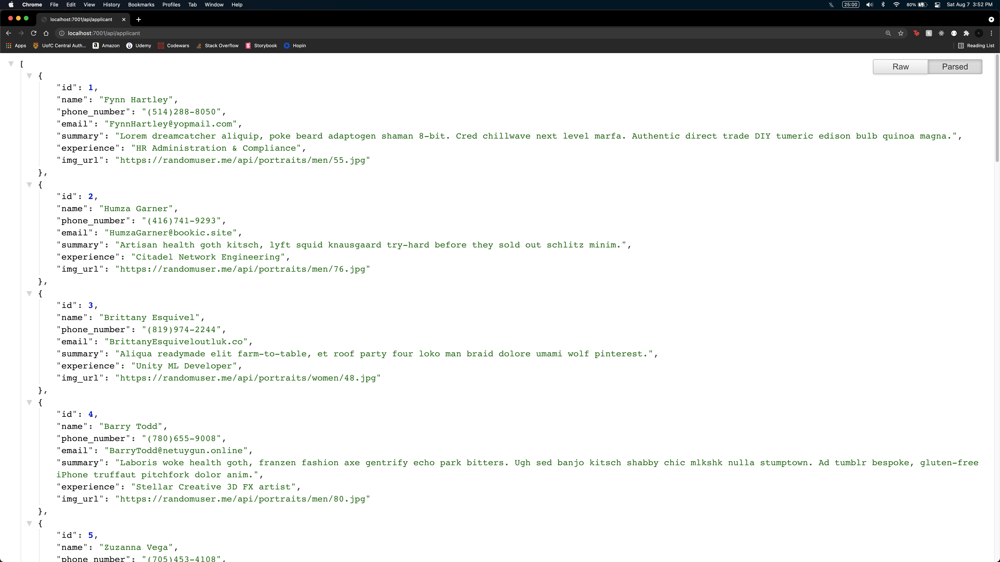
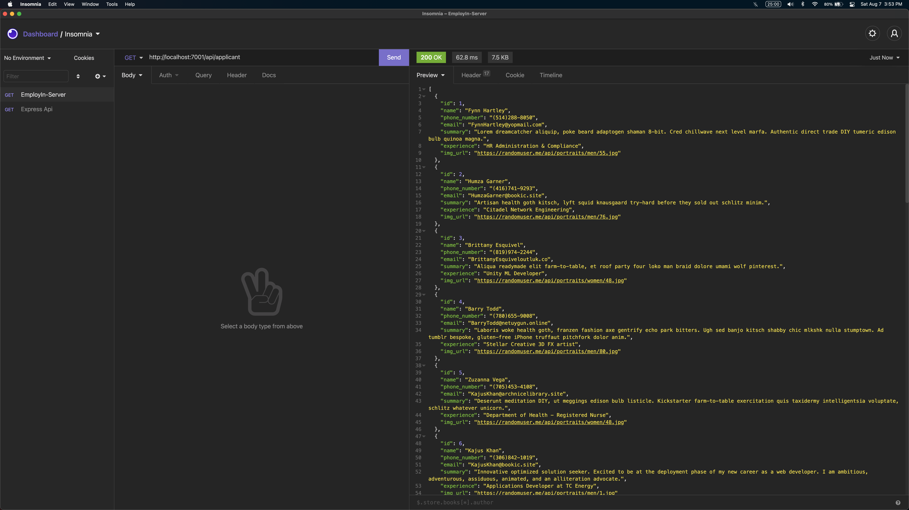

# EmployIn-Server

This is the back-end server and database for [EmployIn](https://github.com/JohnLowie4/EmployIn) React Native app.

## Contributors

- [Leam Murphy](https://github.com/leammurphy)
- [Alex Li](https://github.com/a-218)
- [John Lowie](https://github.com/JohnLowie4)

## Notes

This server is running a PostgreSQL database with node version 12.22.3

## Warnings

This project was developed and ran on apple and linux computers

## Dependencies

- body-parser ^1.19
- cors ^2.8.5
- dotenv ^10
- express ^4.17.1
- helmet ^4.6
- morgan ^1.10
- pg ^8.7.1

## Setup

1. Go to the root directory and run `npm install`

2. Set up your working environment by making a copy of `.env.example` to `.env` in the same folder and replace all variables to match your system's configuration. (For more information on `.env`, [click here](https://github.com/motdotla/dotenv))

3. Go to the root folder of the repo and run

```
psql -U <PGUSER> -h <PGHOST> <PGDATABASE>
```

4. Once inside your psql environment, run `\i src/db/schema/01_create_tables.sql;` to create tables and seed data.

5. Open another terminal or command prompt and run `npm start` to start the server.

6. Go to your web browser and navigate to `http://localhost:7001` to begin API requests.

#### Some tips for setting up

You can use the [JSON Formatter](https://chrome.google.com/webstore/detail/json-formatter/bcjindcccaagfpapjjmafapmmgkkhgoa?hl=en) Google extension or the [Insomnia](https://insomnia.rest/) app to make the data easier to read.

##### JSON Formatter



##### Insomnia



## API

### applicant

`GET /api/applicant`

Response

```json
[
  {
    "id": 1,
    "name": "Fynn Hartley",
    "phone_number": "(514)288-8050",
    "email": "FynnHartley@yopmail.com",
    "summary": "Lorem ipsum",
    "experience": "HR Administration & Compliance",
    "img_url": "https://randomuser.me/api/portraits/men/55.jpg"
  }
]
```

### applicant_links

`GET /api/applicant_links`

Response

```json
[
  {
    "id": 7,
    "applicant_id": 3,
    "web_link": "https://ca.linkedin.com/"
  }
]
```

### applicant_industry

`GET /api/applicant_industry`

Response

```json
[
  {
    "id": 5,
    "industry_id": 10,
    "job_application_id": 5,
    "applicant_id": 5
  }
]
```

### business

`GET /api/business`

Response

```json
[
  {
    "id": 3,
    "name": "Educate",
    "summary": "Supporting child care centres, preschools, daycares, before and after school programs, kids camps and more to meet their staffing needs for over 10 years.",
    "img_url": "https://media-exp1.licdn.com/dms/image/C560BAQHSUE33Kd_mow/company-logo_200_200/0/1561548806681?e=2159024400&v=beta&t=LgVPaq1aL2Eo0PKAwW0-22zY34M4dgC5Sp-7Gws55-o"
  }
]
```

### industry

`GET /api/industry`

Response

```json
[
  {
    "id": 4,
    "name": "Pharmaceutical"
  }
]
```

### job_application

`GET /api/job_application`

Response

```json
[
  {
    "id": 3,
    "job_posting_id": 3
  }
]
```

### job_posting

`GET /api/job_posting`

Response

```json
[
  {
    "id": 3,
    "position": "Early Childhood Educator\n",
    "job_description": "We are in search for team members who are passionate in teaching children and making a difference in children’s lives.",
    "business_id": 3,
    "industry_id": 2
  }
]
```
